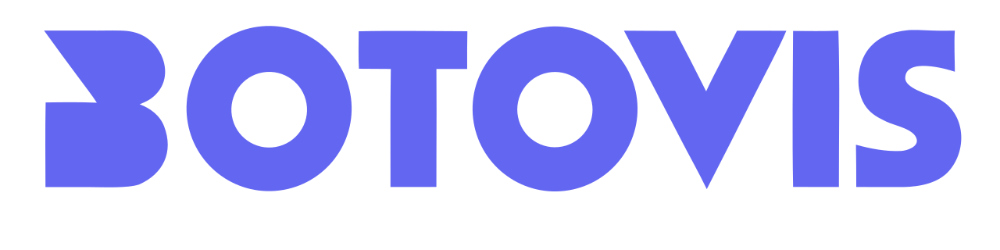

<p align="center">
  <picture>
    <source media="(prefers-color-scheme: dark)" srcset="art/logo-dark.svg">
    <source media="(prefers-color-scheme: light)" srcset="art/logo.svg">
    
  </picture>
</p>

<p align="center">
  <strong>AI-powered natural language interface for your database.</strong><br>
  Drop a chat widget into your Laravel app — your users can query, analyze, and modify data just by asking.
</p>

<p align="center">
  <a href="https://github.com/hikmetozcann/botovis/actions"></a>
  <a href="https://packagist.org/packages/botovis/botovis-laravel"></a>
  <a href="https://packagist.org/packages/botovis/botovis-laravel"></a>
  <a href="https://packagist.org/packages/botovis/botovis-laravel"></a>
  <a href="LICENSE"></a>
</p>

<p align="center">
  <a href="#installation">Installation</a> •
  <a href="#quick-start">Quick Start</a> •
  <a href="#how-it-works">How It Works</a> •
  <a href="#configuration">Configuration</a> •
  <a href="docs/en/README.md">Full Documentation</a> •
  <a href="docs/tr/README.md">Türkçe Dokümantasyon</a>
</p>

---

## What is Botovis?

Botovis is a Laravel package that adds an AI-powered chat widget to your application. Users can interact with your database using plain language — no SQL, no custom forms, no dashboards.

```
User: "How many orders were placed last month?"
Botovis: Uses count_records tool → "There were 847 orders last month."

User: "Show me the top 5 customers by revenue"
Botovis: Uses aggregate + search tools → Displays a formatted table

User: "Create a new product called 'Widget Pro' priced at $29.99"
Botovis: Asks for confirmation → Creates the record after approval
```

### Key Features

- **Natural language CRUD** — Search, count, aggregate, create, update, delete via conversation
- **AI Agent with ReAct pattern** — Multi-step reasoning with parallel tool calling
- **Write protection** — All write operations require explicit user confirmation
- **Role-based security** — Integrates with your existing auth (Gates, Spatie, custom callbacks)
- **Real-time streaming** — Server-Sent Events with live reasoning timeline
- **Multi-LLM support** — OpenAI, Anthropic (Claude), Ollama (local)
- **Zero-dependency widget** — Web Component with Shadow DOM, works everywhere
- **Conversation history** — Persistent chat threads (database or session storage)
- **Framework wrappers** — React and Vue 3 components included
- **i18n** — English and Turkish built-in; AI auto-responds in the user's language

---

## Installation

```bash
composer require botovis/botovis
```

```bash
php artisan vendor:publish --tag=botovis-config
php artisan vendor:publish --tag=botovis-assets
php artisan migrate
```

Add your LLM API key to `.env`:

```env
BOTOVIS_LLM_DRIVER=anthropic
BOTOVIS_ANTHROPIC_API_KEY=sk-ant-...
```

> Also supports `openai` and `ollama` drivers. See [Configuration](docs/en/configuration.md).

---

## Quick Start

### 1. Register your models

```php
// config/botovis.php
'models' => [
    App\Models\Product::class  => ['create', 'read', 'update', 'delete'],
    App\Models\Category::class => ['read'],
    App\Models\Order::class    => ['read'],
],
```

### 2. Add the widget

```blade
@botovisWidget
```

### 3. Verify

```bash
php artisan botovis:discover   # See what Botovis found
php artisan botovis:chat       # Test in terminal
```

That's it. Visit your app and click the chat button.

---

## How It Works

Botovis uses an **AI Agent** with the [ReAct](https://arxiv.org/abs/2210.03629) pattern — it thinks, acts (calls tools), observes results, and repeats until it has an answer:

```
User → "How many orders per status?"

Step 1  Think: "I need to group orders by status"
        Act:   aggregate(table: orders, function: count, group_by: status)
        Observe: [{status: pending, count: 42}, {status: shipped, count: 315}, ...]

Step 2  Think: "I have the data, I'll format a table"
        Respond: | Status | Count | ...
```

### Tools

| Tool | Type | Description |
|------|------|-------------|
| `search_records` | Read | Search with filters, sorting, column selection |
| `count_records` | Read | Count records with optional conditions |
| `get_sample_data` | Read | Preview table structure and content |
| `get_column_stats` | Read | Min, max, avg, distinct values |
| `aggregate` | Read | COUNT, SUM, AVG, MIN, MAX with GROUP BY |
| `create_record` | **Write** | Create record *(requires confirmation)* |
| `update_record` | **Write** | Update records *(requires confirmation)* |
| `delete_record` | **Write** | Delete records *(requires confirmation)* |

### Parallel Tool Calling

The agent calls multiple tools simultaneously when possible — e.g., counting 7 tables in a single step.

### Generate Stopping

If the agent approaches its step limit, it automatically summarizes with available data instead of failing.

---

## Configuration

Key settings in `config/botovis.php`:

```php
'mode'   => 'agent',           // 'agent' or 'simple'
'locale' => 'en',              // 'en' or 'tr'

'agent' => [
    'max_steps' => 10,         // Max reasoning steps
    'streaming' => true,       // SSE real-time updates
],

'llm' => [
    'driver' => 'anthropic',   // 'openai', 'anthropic', 'ollama'
],

'security' => [
    'require_auth' => true,
    'require_confirmation' => ['create', 'update', 'delete'],
    'roles' => [
        'admin' => ['*' => ['create', 'read', 'update', 'delete']],
        'user'  => ['*' => ['read']],
    ],
],
```

→ Full reference: [docs/en/configuration.md](docs/en/configuration.md)

---

## Widget

```blade
@botovisWidget(['theme' => 'dark', 'lang' => 'en', 'position' => 'bottom-left'])
```

| Attribute | Values | Default |
|-----------|--------|---------|
| `theme` | `auto`, `light`, `dark` | `auto` |
| `lang` | `en`, `tr` | `en` |
| `position` | `bottom-right`, `bottom-left` | `bottom-right` |
| `streaming` | `true`, `false` | `true` |

```javascript
// JavaScript API
const widget = document.querySelector('botovis-chat');
widget.open();
widget.send('How many products are there?');
```

→ Full guide: [docs/en/widget.md](docs/en/widget.md)

---

## Documentation

| English | Türkçe | Description |
|---------|--------|-------------|
| [Installation](docs/en/installation.md) | [Kurulum](docs/tr/installation.md) | Requirements, setup, verification |
| [Configuration](docs/en/configuration.md) | [Yapılandırma](docs/tr/configuration.md) | All config options |
| [Security](docs/en/security.md) | [Güvenlik](docs/tr/security.md) | Auth, roles, permissions |
| [Tools](docs/en/tools.md) | [Araçlar](docs/tr/tools.md) | Built-in tools, custom tools |
| [Widget](docs/en/widget.md) | [Widget](docs/tr/widget.md) | Attributes, theming, wrappers |
| [API Reference](docs/en/api-reference.md) | [API Referansı](docs/tr/api-reference.md) | HTTP endpoints |
| [Artisan Commands](docs/en/artisan-commands.md) | [Artisan Komutları](docs/tr/artisan-commands.md) | CLI tools |
| [Architecture](docs/en/architecture.md) | [Mimari](docs/tr/architecture.md) | Internals, extension points |

---

## Requirements

- PHP ≥ 8.1
- Laravel 10, 11, or 12
- LLM API key (OpenAI, Anthropic) or local Ollama

## License

MIT — see [LICENSE](LICENSE) for details.
